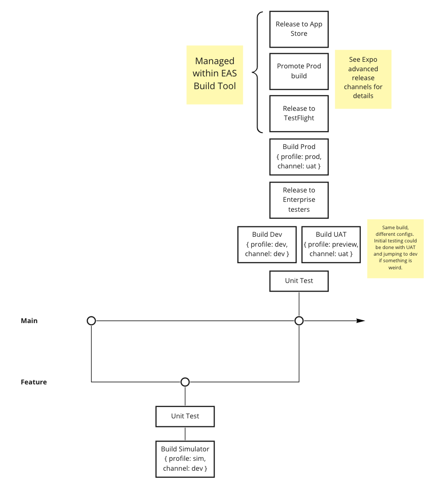

# ChefNote

## Getting Started
1. Download and install XCode
2. Install the Expo dependencies with `make bootstrap`
3. Install the application dependencies with `npm install`
4. Start the application with `make start`

## CI/CD Pipeline


We have four different build configurations:
1. Development - a development build that includes debugging functionality.  Not suitable for release to beta users or general availability.
2. Simulator - a production like build designed to be installed on a simulator
3. Preview - a production like build that is not signed for App Store distribution.  Used for testing on actual devices.
4. Production - a production build specifically for App Store distribution.

The current design of the pipeline is to run basic tests and create a development build when code is pushed to Main.

Additional builds are created manually to save on minutes in the Expo Build tool.  There is a production build job that can be run manually which will create a production build that can be distributed via TestFlight and then promoted to the App Store.  Builds are pushed to the App Store using EAS Build: https://expo.dev/accounts/chefnoteapp

**Note:** We currently don't have any tests so the testing step is essentially a no-op placeholder
**Note:** Since we do not have Github enterprise and this is not a public project, we do not have access to Environments where we can add variables.  Any variables added to the pipeline should be prefixed with an environment variable if needed.
### Useful Resources
* [Trigger builds from CI - Expo docs](https://docs.expo.dev/build/building-on-ci/)
* [ChefNote Scratchpad - Miro](https://miro.com/app/board/o9J_l1HDNQY=/)

## Submitting to the App Store


## State Structure
### State
```
{
  recipes: {
    recent: [
      { /* recipe metadata */, [ingredients], [instructions] }
    ],
    all: [
      { /* recipe detail */ }
    ]
  ],
  ingredients: [
    { /* ingredient detail */ }
  ]
}
```

### Actions
* recipeAdded, payload: Recipe
* recipeChanged, payload: Recipe
* recipeIngredientsChanged, payload: [ingredients]
* recipeInstructionsChanged, payload: [instructions]
* ingredientAdded, payload: Ingredient
* viewRecipe, payload: Recipe (push to recent, pop oldest)


## LocalStorage Structure
```
{
  recipes: [Recipe],
  recentRecipes: [RecipeMetadata],
  ingredients: [Ingredients]
}
```